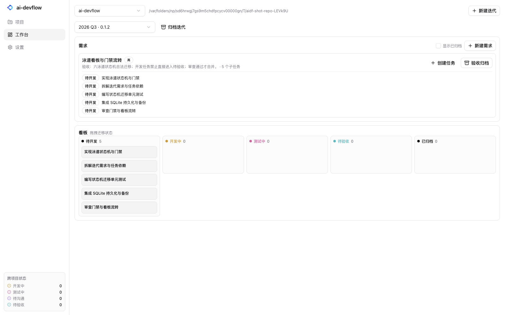
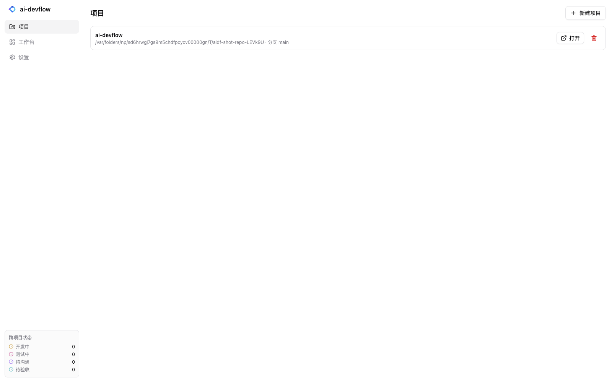
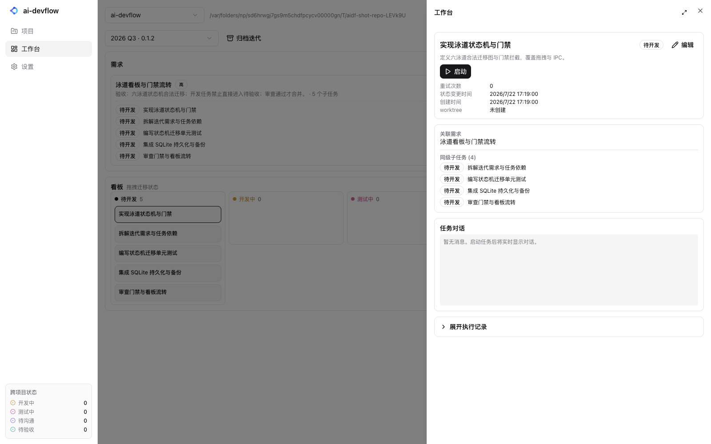
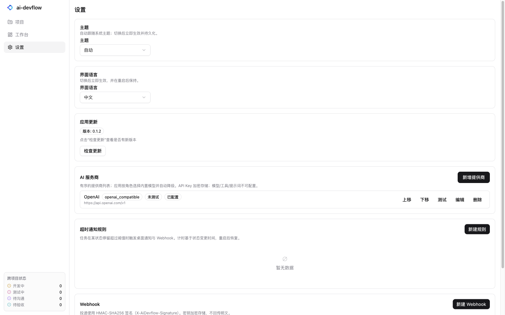

<p align="center">
  
</p>

<h3 align="center">本地优先的 AI 开发工作台</h3>

<p align="center">
  把自动化开发流程做成泳道看板，由内置 Agent 在隔离的 Git worktree 中真实执行任务。<br>
  无需安装任何 Agent CLI 或 Node.js，只需配置一个 AI 服务商列表即可开始。
</p>

<p align="center">
  <a href="#快速开始">快速开始</a> ·
  <a href="#安装">安装</a> ·
  <a href="#卸载">卸载</a> ·
  <a href="#开发">开发</a> ·
  <a href="#参与贡献">参与贡献</a>
</p>



## ✨ 这是什么

**ai-devflow** 是一款面向个人开发者与小团队的桌面应用：把需求、迭代、任务放到一张泳道看板里，然后交给内置的 AI Agent 自动执行。每个任务都会在独立的 Git worktree 中运行，所有状态、执行记录、对话消息与检查点都保存在本地 SQLite，关闭或重启应用后自动恢复。

### 核心亮点

- **泳道看板**：`待开发 → 开发中 → 测试中 → 待验收 → 已归档`，拖拽即可迁移状态；非法流转会被门禁拦截。
- **内置 Pi 运行时**：固定版本 `@earendil-works/pi-coding-agent@0.80.10` 随应用打包，绝不读取系统 PATH 里的 `pi`，也不运行时下载或自升级。
- **四角色协作**：`planner / coder / reviewer / tester` 各自拥有独立的 profile、模型映射与安全策略；coder 完成后 reviewer 自动审查，通过才进入待验收。
- **有序 AI 服务商列表**：你只负责配置「类型 + API Key + Base URL + 排序」，模型、备用模型、thinking、工具、扩展、系统提示词均由应用内置，并在首选不可用时自动降级。
- **本地优先**：项目仓库、数据库、执行 worktree 都在你的机器上；API Key 使用系统安全存储加密，不离开本机。
- **任务即对话**：每个任务详情都是聊天窗口，Agent 实时汇报进度、遇到需要确认或澄清时会暂停，等你回复后再继续。

> 想看底层设计、Pi 运行时隔离、自动更新与发版细节？请移步 [docs/architecture.md](docs/architecture.md)。

## 🖼️ 产品截图

| 项目与导入 | 泳道看板 | 任务详情 | AI 服务商设置 |
|---|---|---|---|
|  |  |  |  |

## 🚀 快速开始

1. **下载安装包**：访问 [GitHub Releases](https://github.com/Aiden-FE/ai-devflow/releases/latest)，选择对应系统的安装包。
2. **macOS 放行**（仅 macOS）：由于应用采用 Ad hoc 签名、未经公证，首次启动前需要移除隔离属性，见 [macOS 安装](#macos)。
3. **打开应用**，点击左侧「设置」→「AI 服务商」→「新增提供商」。
4. **配置一个 AI 服务商**：选择类型（如 `openai_compatible`）、填写显示名称、API Key，兼容网关再填 Base URL，保存。
5. **回到「项目」页**，导入或创建一个本地 Git 仓库。
6. **进入工作台**，新建迭代 → 新建需求 → 创建任务 → 点击任务卡片里的「启动」。
7. 在任务详情窗口里即可看到 Agent 实时执行与对话。

## 📦 安装

### macOS

支持 Apple Silicon（arm64）与 Intel（x64）。提供两种格式：

- **DMG**：双击挂载，把 `ai-devflow.app` 拖到「应用程序」文件夹。
- **ZIP**：解压后把 `ai-devflow.app` 拖到「应用程序」文件夹。

由于 macOS 官方发版采用 **Ad hoc（无证书）签名**、未经 Apple 公证，从浏览器下载的应用会被 Gatekeeper 隔离。首次启动前请在终端执行：

```bash
xattr -d com.apple.quarantine /Applications/ai-devflow.app
```

> 如果不执行上述命令，启动时可能提示「无法打开」或「已损坏」。右键「打开」通常也能触发一次放行，但 `xattr -d` 是最稳妥的方式。

### Windows

- 下载 `ai-devflow-<version>-win-x64.exe`（NSIS 安装包）。
- 双击运行安装向导。
- 安装完成后从开始菜单或桌面快捷方式启动。

### Linux

- 下载 `ai-devflow-<version>-linux-x86_64.AppImage`。
- 赋予可执行权限：

```bash
chmod +x ai-devflow-*.AppImage
```

- 双击运行或在终端直接执行：

```bash
./ai-devflow-*.AppImage
```

## 🗑️ 卸载

### macOS

```bash
rm -rf /Applications/ai-devflow.app
# 应用数据（数据库、配置、缓存）
rm -rf ~/Library/Application\ Support/ai-devflow
```

### Windows

1. 打开「设置 → 应用 → 已安装的应用」。
2. 找到 **ai-devflow** 并卸载。
3. 如需清理数据，删除 `%APPDATA%\ai-devflow` 目录。

### Linux

```bash
# 删除 AppImage 文件本身
rm /path/to/ai-devflow-*.AppImage
# 删除应用数据
rm -rf ~/.config/ai-devflow
```

## 🔄 更新

- **Windows / Linux**：应用启动后会自动检查更新，下载完成后在设置页点击「立即升级」即可。
- **macOS**：Ad hoc 签名的应用无法被 Squirrel.Mac 自动安装更新。检测到新版本并下载后，点击「立即升级」会打开 GitHub Releases，请手动下载对应架构的最新版并重新安装（同时再次执行 `xattr -d com.apple.quarantine /Applications/ai-devflow.app`）。

## 🛠️ 开发

如果你想从源码运行或打包：

**环境要求**

- Node.js ≥ 22
- pnpm 11
- git

**安装依赖**

```bash
pnpm install
```

仓库根目录 `.npmrc` 已配置 Electron 二进制走 npmmirror 镜像；若镜像不可用，可设置 `ELECTRON_MIRROR` 后执行 `pnpm rebuild electron`。

**开发模式**

```bash
pnpm dev
```

**构建与打包**

```bash
# 构建桌面应用（renderer + electron + 内置 Pi 运行时）
pnpm --filter @ai-devflow/desktop build

# 仅生成 unpacked 目录
pnpm --filter @ai-devflow/desktop package

# 生成发布安装包（dmg/zip/exe/AppImage）
pnpm --filter @ai-devflow/desktop dist
```

**验证**

```bash
pnpm verify        # typecheck + lint + test + scripts
pnpm test          # 全部单元/集成测试
pnpm --filter @ai-devflow/desktop e2e
```

## 🤝 参与贡献

欢迎 Issue 与 PR！开始前请确保：

1. 在 Issue 中描述清楚问题或需求；如果是较大改动，建议先开 Issue 讨论。
2. 代码需通过 `pnpm verify`（typecheck、lint、test）。
3. 提交信息遵循 [Conventional Commits](https://www.conventionalcommits.org/)，例如 `feat: 新增 xxx`、`fix: 修复 yyy`、`docs: 更新 zzz`。
4. 修改涉及 UI 时，请同时更新 `/apps/desktop/src/i18n/en.ts` 与 `/apps/desktop/src/i18n/zh.ts`。
5. 若改动影响发版产物或签名流程，请在 PR 描述中说明测试方式。

## 🔒 安全与隐私

- **Renderer 沙箱**：`nodeIntegration=false`、`contextIsolation=true`、`sandbox=true`，仅通过类型化 IPC 与主进程通信。
- **凭证加密**：API Key 与 Webhook 密钥使用 Electron `safeStorage` 加密落盘，API Key 不回显、不进入日志与 IPC。
- **进程隔离**：内置 Pi 运行时以 `process.execPath` + `ELECTRON_RUN_AS_NODE` 启动，环境从空白白名单构造，cwd 为独立 worktree，角色策略限制写入与命令。
- **数据本地**：数据库、项目仓库、执行 worktree 均保存在你的本地磁盘。

## ❓ 常见问题

**Q: macOS 提示「已损坏，无法打开」怎么办？**

A: 这是 Ad hoc 签名、未经公证的正常表现。在终端执行：

```bash
xattr -d com.apple.quarantine /Applications/ai-devflow.app
```

**Q: 为什么 macOS 不能自动安装更新？**

A: 自动更新（Squirrel.Mac）要求应用由相同的 Apple Developer ID 签名。ai-devflow 采用无证书的 Ad hoc 签名分发，因此 macOS 用户需要到 GitHub Releases 手动下载新版。

**Q: 可以不联网使用吗？**

A: 应用本体与内置 Pi 运行时完全本地；但 Agent 执行任务时需要调用你配置的 AI 服务商 API，因此需要联网。

**Q: 支持哪些 AI 服务商？**

A: anthropic、openai、google、deepseek、openrouter，以及 openai_compatible / anthropic_compatible 兼容网关。模型与工具由内置 profile 决定，用户无需手动选择。

---

<p align="center">
  由 <a href="https://github.com/Aiden-FE">Aiden-FE</a> 与社区共同维护。
</p>
