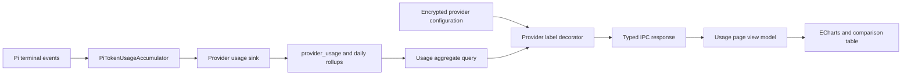

# Usage Statistics Redesign and Knowledge Project Switch Design

**Date:** 2026-07-30

**Status:** Approved

**Scope:** Provider usage correctness and presentation, plus knowledge-page project switching

## Summary

Redesign the provider usage page as a compact ECharts-based operational dashboard, repair Token capture against the actual Pi 0.80.10 message contract, prevent internal provider identifiers from appearing as user-facing names, and add the existing global project selector to the knowledge page.

The existing `provider_usage` schema, daily rollups, retention behavior, IPC shape, sidebar route, and global project state remain authoritative. This design corrects the boundaries around those systems instead of replacing them.

## Problem Statement

The current implementation has four user-visible problems:

1. The usage page uses a hand-built CSS bar chart and fragmented text lists. It does not provide a clear operational hierarchy or useful comparison at a glance.
2. New OpenAI- and Anthropic-protocol calls show unknown Token totals even though Pi normalizes both protocols into one usage contract.
3. Provider breakdowns can show values such as `776f5082-9779-4a15-8f3d-ac0b7068da9b`, although the user never configured that display name.
4. The knowledge page is bound to the last project opened in the workspace and has no project selector of its own.

## Confirmed Root Causes

### Token capture

`packages/agents/src/token-usage.ts` currently rejects any completed message without a non-empty `message.id`. Pi 0.80.10 defines `AssistantMessage` without an `id` field, so real terminal assistant messages are skipped before their normalized `usage` object is read.

Pi's authoritative normalized usage fields are:

- `input`
- `output`
- `cacheRead`
- `cacheWrite`
- `totalTokens`
- optional `reasoning`, which is already included in `output`
- optional `cacheWrite1h`, which is already included in `cacheWrite`

The application must consume this Pi boundary instead of assuming provider-specific message identifiers or parsing raw OpenAI and Anthropic HTTP response shapes.

### Provider UUID labels

The v15 historical backfill in `provider-usage-migration-v15.ts` derives the provider ID from `execution_attempts.route_id` and writes that same value into both `provider_id` and `provider_name`. Existing route IDs start with the configured provider UUID, so historical rows expose that UUID as a label.

New live calls already attempt to snapshot `ProviderStore.displayName`, but historical raw rows, daily rollups, deleted providers, and runtime-compatible provider names still require a display-name boundary at query time.

### Knowledge project context

`App.tsx` owns one global `project` value and already passes `projects` plus `onSwitchProject` to `WorkspacePage`. `KnowledgePage` receives only one `project`, so it cannot render the same selector. It also retains local snapshot, finding-selection, pending-run, and error state when its `project` prop changes.

## Goals

- Make the usage page immediately answer:
  - Is provider usage healthy?
  - How many logical requests caused how many provider attempts?
  - How many Tokens were consumed, and how complete is Token coverage?
  - Which provider is slow, failing, or consuming the most Tokens?
- Use ECharts for the time trend and Token composition visualizations.
- Capture Token usage from Pi terminal assistant messages without relying on a nonexistent message ID.
- Preserve unknown Token data as unknown rather than fabricating zero or estimating from text.
- Ensure no full UUID or `ai-devflow-<hash>` runtime name is presented as a provider display name.
- Add project switching to the knowledge page using the same global current-project state as the workspace.
- Preserve Electron isolation, local-only analytics, existing retention, and existing navigation semantics.

## Non-Goals

- Cost or pricing calculation.
- Retrospective Token estimation from prompt or response length.
- External analytics or telemetry export.
- Statistics export.
- New statistics database tables or a replacement analytics engine.
- Parsing raw OpenAI or Anthropic wire responses in ai-devflow.
- Independent project selections for workspace and knowledge pages.
- A general redesign of the sidebar, settings, workspace, or knowledge content.

## Selected Approach

Use a targeted boundary repair:

1. Correct the Pi Token accumulator while retaining the current `TokenUsage` and persistence contracts.
2. Decorate analytics results in Electron with user-facing provider labels while retaining stored IDs and historical snapshots.
3. Replace the usage page's hand-built chart with focused ECharts components and reorganize the page around the approved balanced-analysis layout.
4. Reuse `App.tsx` project state and the workspace selector contract in `KnowledgePage`.

A front-end-only patch was rejected because it would leave the broken Token capture boundary in place. A new analytics event model and provider dimension table were rejected as unnecessary for the current defects.

## Architecture



Responsibilities remain separated:

- `packages/agents` owns Pi event normalization and per-attempt Token accumulation.
- `packages/persistence` owns nullable storage, aggregation, rollup, and retention.
- Electron Main owns secrets, provider configuration access, filter validation, and user-facing provider label decoration.
- Renderer owns presentation state, chart options, responsive layout, and drill-down interaction.
- `App.tsx` owns the single current-project state shared by workspace and knowledge pages.

## Token Capture Design

### Event sources

The accumulator consumes completed assistant messages from:

1. `message_end.message`, the primary source.
2. `agent_end.messages`, a terminal fallback for any assistant message not observed through `message_end`.

User and tool-result messages never contribute Token usage.

### Deduplication

Pi emits completed assistant messages through `message_end` and may repeat those messages in `agent_end`. Since `AssistantMessage` has no `id`, deduplication uses an in-memory fingerprint composed only of stable non-content fields:

- `timestamp`
- `provider`
- `model`
- optional `responseId`
- `stopReason`
- normalized usage fields

The fingerprint is scoped to one accumulator and therefore one provider attempt. Message content, prompts, tool arguments, and response text are not hashed or stored.

`message_end` records the fingerprint after accepting usage. `agent_end` skips existing fingerprints and accepts only unseen assistant messages. An event without a usable assistant message or without any usage fields is ignored.

### Normalization rules

- Read Pi's canonical `input`, `output`, `cacheRead`, `cacheWrite`, and `totalTokens` first.
- Retain the existing limited aliases only for backward-compatible fixtures or older event sources; aliases do not replace the canonical path.
- Accept only non-negative safe integers.
- Use `totalTokens` when present.
- If total is absent but at least one component is known, derive total by summing known components.
- Never add `reasoning` separately because Pi documents it as a subset of `output`.
- Never add `cacheWrite1h` separately because Pi documents it as a subset of `cacheWrite`.
- Missing values remain `null`.

### Coverage semantics

A provider call is Token-known when its total is known. `tokenKnownCalls / providerCalls` remains the coverage calculation. Individual components may still be unknown when total is known, and the UI must display those component values independently.

Calls that fail before a completed assistant message, interrupted legacy attempts, and historical v15 backfill rows remain Token-unknown.

## Provider Display Name Design

### Resolver boundary

Create a pure Electron-side resolver with the conceptual contract:

```ts
resolveProviderDisplayName(input: {
  providerId: string;
  storedName: string;
  configuredName?: string;
  locale: 'zh' | 'en';
}): string
```

Resolution order:

1. If a current provider configuration matches `providerId`, use its trimmed `displayName`.
2. If the stored snapshot is a non-internal user-facing name, preserve it.
3. If the snapshot is a standard provider kind such as `openai` or `anthropic`, return its localized standard label.
4. If the snapshot is a UUID, the provider ID itself, or `ai-devflow-<hex>`, return `Historical provider · <short-id>` in English or `历史供应商 · <short-id>` in Chinese.

The short ID keeps the first four and last four visible characters, for example `776f…da9b`. The full `providerId` remains the stable breakdown key and filter value but is never rendered as an internally derived label. A user who explicitly configures a UUID-shaped `displayName` still sees that chosen name because configured names have highest priority.

The analytics IPC handler reads the persisted interface locale from the same credentials value used by `settings.getLocale`, defaulting to Chinese when absent or invalid. Locale does not become a new Renderer-supplied analytics filter.

### Stable provider aggregation

Provider breakdowns must aggregate by stable `provider_id` only. The current query groups by both `provider_id` and `provider_name`, which can split one provider into multiple rows after a rename and can assign the same logical-request count to each row.

Update the repository's provider grouping so:

- metrics group only by `provider_id`;
- logical requests remain distinct within that provider ID;
- one preferred stored label is returned, choosing a non-internal snapshot over a UUID/provider-ID/runtime-hash snapshot when one exists;
- Electron then applies the configured-name and locale-aware resolver.

This preserves one comparison row and one drill-down key per configured provider across renames.

### Query decoration

Add a focused Electron analytics service between `repos.providerUsage.query()` and IPC. It receives `ProviderStore`, builds an ID-to-display-name map, and decorates:

- `UsageAnalytics.providers[].label`
- `UsageAnalytics.latestFailures[].providerName`
- the selected-provider scope label through the decorated provider breakdown

No Renderer UUID detection is allowed.

### Why stored data is not rewritten

Do not add a SQL migration or startup rewrite for provider names:

- Provider configurations are encrypted and unavailable to a static SQL migration.
- `provider_name` participates in daily-rollup primary keys, so rewriting names may collide after provider renames.
- Query decoration covers raw rows, rolled-up rows, current configurations, renamed providers, deleted providers, and already-migrated databases without mutating analytics history.

## Usage Page Experience

### Design classification

The page is a **Redesign · Preserve** of an existing operational tool.

```yaml
artifact: provider usage analytics dashboard
audience: ai-devflow developers and maintainers
visual-language: restrained data-first developer tool
visual-variance: 4/10
motion-intensity: 3/10
information-density: 8/10
asset-dependence: 1/10
brand-fidelity: 9/10
```

Protected contracts:

- sidebar route and label;
- `UsageStatsPage` navigation behavior;
- global-versus-provider filter semantics;
- typed analytics IPC;
- light/dark theme behavior;
- `data-testid="usage-shell"`;
- loading, empty, and error accessibility;
- provider IDs as filter keys.

### Visual system

- Preserve the existing shadcn/ui `new-york` vocabulary and Zinc neutral tokens.
- Use the existing system font. Numeric data uses tabular figures.
- Use a 4 px spacing base with 8, 12, 16, and 24 px steps.
- Controls use 6 px radius; independent metric surfaces use no more than 8 px.
- Charts are unframed page sections, not cards nested inside cards.
- Main-page shadows are removed; only popovers and tooltips receive elevation.
- Chart colors come from existing semantic tokens:
  - calls: foreground;
  - success: `--ok`;
  - failure: `--err`;
  - Tokens: `--lane-in_review`;
  - cache: `--warn`.
- No 3D charts, gradient fills, decorative rings, or unrelated colors.

### Approved balanced-analysis layout

The page order is fixed:

1. Header with page title, current scope, 7/30/90/365-day segmented control, and icon-only refresh command.
2. Six-column KPI band:
   - provider calls;
   - success rate;
   - average duration;
   - total Tokens;
   - Token coverage;
   - failed calls.
3. Two-column analysis row:
   - wide call-and-Token trend;
   - narrow Token composition.
4. Full-width provider comparison table.
5. In-place provider drill-down replacing the global analysis area while retaining page context and a back command.

The page is not a marketing dashboard. Headings remain compact, information is scan-oriented, and controls retain the density of the existing desktop application.

### Trend chart

`UsageTrendChart` uses ECharts with:

- date on the x-axis;
- provider calls on the left y-axis;
- total Tokens on the right y-axis;
- a restrained call line and Token columns;
- mode controls for calls, Tokens, and success rate;
- sparse horizontal grid lines and no vertical grid lines;
- a shared tooltip showing date, call count, success/failure count, Token total, and coverage.

The query already limits the view to daily buckets and at most 365 days, so no sampling is required.

### Token composition

`TokenCompositionChart` uses horizontal bars for input, output, cache read, and cache write. Each row displays the exact numeric value next to the bar. Unknown values display `Unknown` / `未知` and do not render a zero-length bar as if zero were known.

The component also displays `tokenKnownCalls / providerCalls` below the chart.

### Provider comparison and drill-down

The comparison table columns are:

- provider display name;
- provider calls;
- logical requests;
- success rate;
- average duration;
- total Tokens;
- Token coverage;
- detail command.

Selecting a provider updates the existing `providerId` filter. The drill-down shows the decorated provider name and model, project, workload, source, and failure-kind breakdowns. Back clears only `providerId` and preserves the selected time range.

### States

- **Loading:** preserve stable chart and table dimensions with restrained skeletons.
- **Empty:** state that the selected period and filters contain no calls; offer the 365-day range when the current range is shorter.
- **Error:** keep the page shell and show one retry command. Do not display stale data as current.
- **Partial Token:** show known totals and explicit coverage. Unknown values remain labelled unknown.
- **Chart failure:** metrics and the provider table remain usable; the chart region displays a retry message.
- **Deleted provider:** retain drill-down by provider ID and show the resolved historical label.

### Responsive behavior

- Wide main content uses a 12-column grid and the two-column analysis row.
- At narrower desktop widths, charts stack vertically while the KPI band becomes three columns.
- At the narrowest supported application width, KPIs become two columns and the provider table scrolls horizontally inside its own container.
- Font sizes do not scale with viewport width.
- Chart containers use fixed responsive constraints so labels, loading states, and hover content cannot resize the page.

### Accessibility and motion

- Every chart receives an `aria-label` describing its active metric and date range.
- KPIs and the provider table provide a non-canvas representation of the important data.
- Segmented controls and drill-down commands are keyboard accessible with visible focus.
- Tooltips are supplemental, never the only location of a value.
- Normal feedback lasts 120-180 ms; chart updates target approximately 240 ms.
- With `prefers-reduced-motion`, ECharts update animation is disabled or reduced to immediate state changes.

## ECharts Integration

Install `echarts` as an application dependency and import modular features from `echarts/core`. Do not load charts from a CDN and do not add a second chart wrapper dependency.

Create one shared `EChart` component responsible for:

- `echarts.init()` after the container mounts;
- applying options with controlled replacement of series and axes;
- observing the container with `ResizeObserver` and calling `resize()`;
- receiving `useTheme().resolved` and reapplying theme-derived colors;
- disposing the chart and observer on unmount;
- reporting initialization errors to the page without throwing through React.

Chart option builders are pure functions. They receive `UsageAnalytics`, active display mode, locale, and resolved CSS colors. This makes formatting and unknown-value behavior testable without Canvas.

## Knowledge Page Project Switching

### Shared state

Keep `App.tsx` as the only current-project owner. Change `KnowledgePage` to receive:

```ts
interface KnowledgePageProps {
  project: Project;
  projects: Project[];
  onSwitchProject(projectId: string): void;
}
```

Render the same project `Select` contract used by `WorkspacePage`, including the `h-9 w-56` trigger. Place it at the left of the knowledge-page header, with the current project path beside it. Initialization, audit, and repair commands remain on the right.

### Navigation

- If a current project exists, knowledge navigation opens it.
- If projects exist but no project is selected, opening knowledge selects `projects[0]` before changing route.
- If no projects exist, knowledge navigation remains disabled.
- Switching in knowledge updates the global project, so returning to workspace opens the same project.

### State reset and guards

On `project.id` change:

- clear the old snapshot before requesting the new one;
- clear selected finding IDs;
- clear stale errors;
- show a stable loading state;
- ensure all subsequent commands close over the new project ID.

Disable project switching while an initialization, audit, repair, confirm, or cancel request is in flight. Also disable switching while `pendingRun` awaits confirmation. The user must confirm or cancel that draft before leaving the project, preserving access to the only confirmation controls.

## Error Handling and Consistency

- Usage capture remains best effort and must never change AI execution success or failure.
- Accumulator parsing ignores malformed or unsupported usage while preserving other execution events.
- Provider label decoration never accesses or returns API keys, encrypted payloads, or credential references.
- A failure to read provider configurations falls back to safe stored labels and historical short IDs.
- Analytics filter validation remains in Main before repository access.
- Renderer never receives raw provider configuration secrets and never determines whether a string is sensitive.
- Knowledge project switching cannot occur during an operation or unresolved draft, preventing commands from targeting a different project than the visible snapshot.

## File Impact Map

### Core analytics and runtime capture

- Modify `packages/agents/src/token-usage.ts` for no-ID terminal-message capture and fingerprint deduplication.
- Modify `packages/agents/src/__tests__/token-usage.test.ts` with canonical Pi 0.80.10 messages.
- Extend existing PiRunner and text-executor integration tests to assert persisted Token values on both execution paths.
- No `packages/core/src/analytics.ts` contract change is required.
- No persistence schema migration is required.
- Modify `packages/persistence/src/provider-usage.ts` so provider breakdowns group by `provider_id` rather than mutable display-name snapshots.
- Extend `packages/persistence/src/__tests__/provider-usage.test.ts` for renamed-provider aggregation.

### Electron analytics boundary

- Create `apps/desktop/electron/usage-analytics.ts` for pure label resolution and result decoration.
- Create `apps/desktop/electron/__tests__/usage-analytics.test.ts`.
- Modify `apps/desktop/electron/ipc.ts` so `analytics.query` returns decorated repository results.
- Modify existing IPC tests for sanitized provider names.

### Usage UI

- Add `echarts` to `apps/desktop/package.json` and update `pnpm-lock.yaml`.
- Keep `apps/desktop/src/pages/UsageStats.tsx` as the page controller.
- Create focused components under `apps/desktop/src/components/usage/`:
  - `EChart.tsx`
  - `UsageSummary.tsx`
  - `UsageTrendChart.tsx`
  - `TokenCompositionChart.tsx`
  - `ProviderComparisonTable.tsx`
  - `ProviderDrilldown.tsx`
- Extend `apps/desktop/src/__tests__/usage-stats.test.tsx`.
- Add focused chart option and lifecycle tests under `apps/desktop/src/__tests__/`.
- Update both `apps/desktop/src/i18n/zh.ts` and `apps/desktop/src/i18n/en.ts`.

### Knowledge project selector

- Modify `apps/desktop/src/App.tsx` to pass the project list and switch callback and to select the first project when appropriate.
- Modify `apps/desktop/src/pages/Knowledge.tsx` for the selector, state reset, and switching guards.
- Extend `apps/desktop/src/__tests__/knowledge-page.test.tsx`.
- Update both locale files for new loading, switching, and guard text if needed.

## Test Strategy

### Token unit tests

- Canonical Pi assistant message without `id` is counted.
- The same message in `message_end` and `agent_end` is counted once.
- Multiple tool-use assistant turns are each counted once.
- `agent_end` supplies usage when `message_end` is absent.
- User and tool-result messages are ignored.
- Invalid negative, fractional, unsafe, and non-number values remain unknown.
- Missing total derives from known components.
- `reasoning` and `cacheWrite1h` are not double counted.
- Missing usage produces all-null output.

### Runtime integration tests

- PiRunner writes exact Token values for a successful provider attempt.
- Text AI writes exact Token values for a successful streamed attempt.
- Retry and failover attempts keep separate usage records.
- Failure before a terminal assistant message remains Token-unknown.
- A throwing usage sink does not affect AI behavior.

### Provider label tests

- Current configured name wins.
- Provider rows before and after a rename coalesce under one provider ID without double-counting logical requests.
- A valid deleted-provider snapshot remains visible.
- Standard provider kinds are localized.
- UUID, provider-ID, and `ai-devflow-<hash>` snapshots become historical short labels.
- Latest failures and provider breakdowns use the same resolver.
- Full internal IDs remain keys but do not appear in visible labels.

### Renderer tests

- Default global metrics and provider rows render.
- Provider detail preserves the time range and clears correctly on back.
- Known and unknown Token components render independently.
- Loading, empty, query error, and chart initialization failure retain the page shell.
- ECharts option builders use theme colors and correct unknown-value gaps.
- `EChart` initializes once per mount, resizes, reacts to resolved theme, and disposes.

### Knowledge tests

- The selector lists all projects and displays the active project.
- Switching invokes the global callback with the selected ID.
- Switching clears old snapshot, selected findings, and error state before loading.
- Switching is disabled while busy.
- Switching is disabled while a draft awaits confirmation.
- Initialization, audit, and repair use the newly selected project ID.

### Desktop E2E

Seed deterministic usage records and projects, then verify:

- usage navigation and KPI values;
- nonblank trend and Token charts;
- provider drill-down and back behavior;
- no visible full UUID or `ai-devflow-<hash>`;
- partial Token coverage;
- light and dark themes;
- desktop and narrow-window screenshots without overlap, clipping, or page-level horizontal overflow;
- knowledge project switching and workspace synchronization.

## Acceptance Criteria

1. A real Pi 0.80.10 assistant message without `id` produces persisted Token totals.
2. The same completed message repeated by terminal events is not double counted.
3. OpenAI- and Anthropic-compatible routes both use the same normalized Pi usage path.
4. The usage page uses ECharts for trend and Token composition and follows the approved balanced-analysis layout.
5. Unknown Token values remain visibly unknown and coverage remains mathematically correct.
6. No internally derived full provider UUID or compatible-provider hash is shown as a supplier name; an explicitly configured display name remains authoritative.
7. Current, renamed, deleted, and historical providers remain distinguishable without rewriting stored aggregates.
8. The usage page remains usable when a chart fails to initialize.
9. Knowledge has the same project selector behavior as workspace and updates the global current project.
10. Knowledge never shows one project's snapshot while sending commands for another project.
11. Existing analytics retention, IPC isolation, sidebar navigation, and unrelated dirty worktree changes remain intact.

## Rollout and Compatibility

- Existing databases require no schema migration.
- Historical Token fields remain unknown because no values are fabricated.
- Existing provider IDs and filter behavior remain stable.
- The new label decoration applies immediately to historical raw and rolled-up results.
- The ECharts dependency is bundled with the desktop renderer; no runtime network access is required.
- Implementation should be delivered in independently testable commits for Token capture, Main-process label decoration, usage UI, and knowledge switching.
